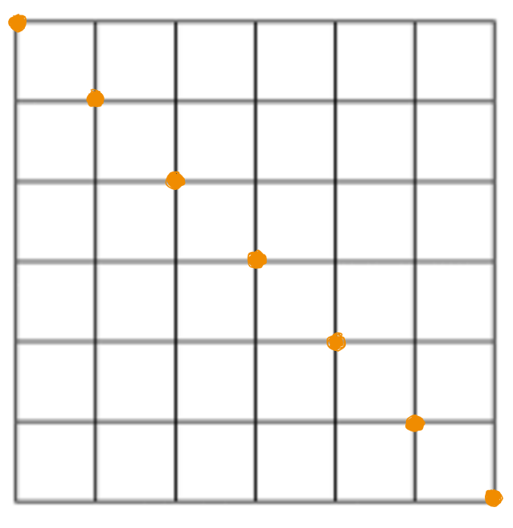
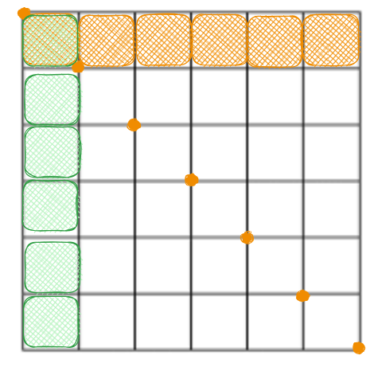
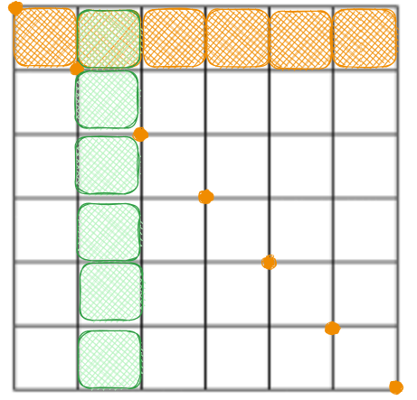

# Create grid function app

This function app takes a square containing Berlin and splits it up into 1600 squares each 0.5km in length

## Create diagonal points

First we create diagonal points. Each of those diagonal points is part of an horizontal line and a vertical line. We will then use those points to draw the rest of the points

## Create the rest of the grid

We go through each diagonal point:
- the latitude of all the squares of that row will be the same as the diagonal point so we use that 
- we loop through all the diagonal points again to find out the longitude of each square

## Example:
### The first column of the first row (top left square)

### The second column of the first row (second square of the top row)
